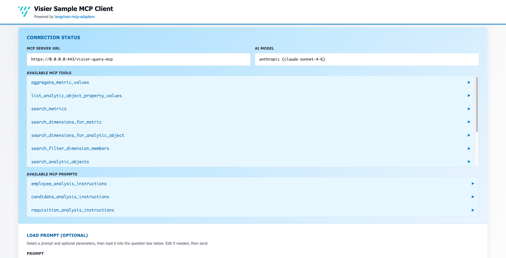
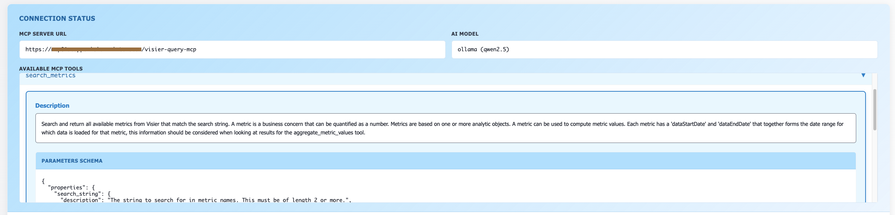
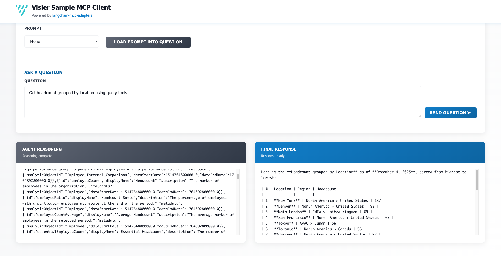
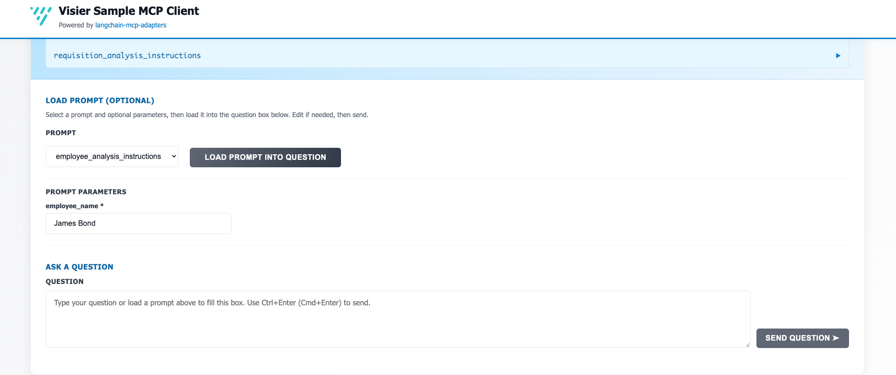

# LangGraph MCP Client for Visier with Web UI

This project provides a LangGraph MCP (Model Context Protocol) client for connecting to a Visier MCP server using OAuth 2.0 authorization code flow. It features a web UI that lets you interact with an AI agent to query your Visier data.


## Screenshots


*The main interface shows server connection details, available MCP tools, and a simple agent chat interface.*


*Click to expand any tool and view its description and parameter schema, this is exactly what the agent sees when making decisions.*


*Ask a question and see the agent's reasoning and response.*


*Select a prompt and click Load Prompt Into Question to use a prompt.*

## Features

- **OAuth 2.0 Authentication**: Secure connection to your Visier tenant
- **Flexible AI Backend**: See [LLM configuration section](#llm-setup-choose-one)
- **Agent Transparency**: See both the agent's streamed thinking process and final responses
- **Visier Integration**: Direct access to your Visier analytics through MCP tools
- **Free Option**: Works completely free with local Ollama models

## Architecture

```
sample-langchain-mcp-client/
├── client/
│   ├── client.py          # Authentication, MCP connection, and app wiring
│   ├── agent_backend.py   # AgentBackend interface
│   ├── langchain_agent.py # LangChain/LangGraph agent backend
│   ├── bedrock_agent.py   # AWS boto3 Bedrock agent backend
│   ├── llm_provider.py    # LangChain LLM provider selection
│   ├── messages.py        # Messages and prompts
│   └── oauth2.py          # Password grant OAuth provider
├── web/
│   ├── web_ui_server.py   # Web server and HTTP request handling
│   └── web_ui.html        # Frontend interface
├── main.py                # Entry point script
├── pyproject.toml         # Project dependencies
└── README.md              # This file
```

### Agent backends

The agent abstraction (`agent_backend.py`) allows switching LLM backends without changing any other code. Both backends function the same. This is just showcasing how each backend can be implemented.

| `AGENT_BACKEND` | `LLM_PROVIDER` | How it works |
|---|---|---|
| `langchain` (default) | `ollama` / `anthropic` / `bedrock` / `openai` | LangGraph react-agent loop via LangChain |
| `boto3` | *(always bedrock)* | Direct AWS boto3 Converse API loop, no LangChain in the agent loop |

## Prerequisites

- Python 3.13+
- Access to a Visier tenant with OAuth client credentials
- Required Python packages (Install all with `uv sync`)

## Required Environment Variables

Before running the client, you must set the following environment variables:

### Visier MCP Server Variables

#### `VISIER_OAUTH_CLIENT_ID`
**Required**: Your Visier OAuth Client ID
- **Description**: The OAuth Client ID registered in your Visier tenant's settings

#### `VISIER_OAUTH_CLIENT_SECRET`
**Required**: Your Visier OAuth Client Secret
- **Description**: The OAuth Client Secret registered in your Visier tenant's settings

#### `VISIER_MCP_SERVER_URL`
**Required**: The URL of your Visier MCP server
- **Description**: The base URL for your Visier tenant's MCP server endpoint
- **Format**: `https://{vanity_name}.app.visier.com/visier-query-mcp`

#### `VISIER_USERNAME` & `VISIER_PASSWORD`
**Optional**: For password grant authentication flow
- **Description**: If both are provided, uses password grant instead of authorization code flow
- **Use Case**: Automated/headless environments where browser OAuth isn't available

#### `VISIER_TENANT_VANITY`
**Optional**: Your Visier tenant's vanity name
- **Description**: This is only needed in certain development scenarios

### Agent Backend

#### `AGENT_BACKEND`
**Optional**: Which agent loop implementation to use
- **Options**: `langchain` (default), `boto3`
- **`langchain`**: Uses LangGraph react-agent loop. `LLM_PROVIDER` selects the model.
- **`boto3`**: Drives the Bedrock Converse API directly. No LangChain in the agent loop. `LLM_PROVIDER` is ignored and Bedrock is used.

### LLM Provider Configuration

#### `LLM_PROVIDER`
**Optional**: Choose your AI provider (only used when `AGENT_BACKEND=langchain`)
- **Options**: `ollama`, `anthropic`, `bedrock`, `openai`
- **Default**: `ollama`
- **Example**: `export LLM_PROVIDER="bedrock"`

#### `LLM_MODEL_ID`
**Optional**: Specific model identifier
- **Examples**:
  - Ollama: `qwen2.5`, `llama3.1`
  - Anthropic: `claude-3-5-sonnet-20241022`
  - Bedrock (LangChain or boto3): `anthropic.claude-3-5-sonnet-20241022-v2:0`
  - OpenAI: `gpt-4-turbo`

### AWS Bedrock Variables

#### `AWS_BEARER_TOKEN_BEDROCK`
**Required for Langchain using Bedrock**: AWS Bearer Token for Bedrock access if Langchain agent is used.
- **Description**: Bearer token for AWS Bedrock authentication
- **Note**: Only needed when `AGENT_BACKEND=langchain` and `LLM_PROVIDER=bedrock`. Not used by the boto3 path, which relies on SigV4 signing and does not support Bedrock API keys.

#### `AWS_REGION_BEDROCK`
**Optional**: AWS region for Bedrock
- **Description**: AWS region where your Bedrock models are available
- **Default**: `us-west-2`

#### AWS credentials
boto3 resolves credentials automatically from the standard AWS credential chain:
`~/.aws/credentials` → `AWS_ACCESS_KEY_ID` / `AWS_SECRET_ACCESS_KEY` env vars → IAM role.
No additional env var is needed beyond region.

### Anthropic Variables

#### `ANTHROPIC_API_KEY`
**Required for Anthropic**: Anthropic API key
- **Description**: Your Anthropic API key for direct Claude access
- **Note**: Required when using `LLM_PROVIDER=anthropic`

### OpenAI Variables

#### `OPENAI_API_KEY`
**Required for OpenAI**: OpenAI API key
- **Description**: Your OpenAI API key for GPT model access
- **Note**: Required when using `LLM_PROVIDER=openai`

## Setup Instructions

### Basic Setup (Required)

1. **Set environment variables**:
   ```bash
   export VISIER_OAUTH_CLIENT_ID="your-client-id"
   export VISIER_OAUTH_CLIENT_SECRET="your-client-secret" 
   export VISIER_MCP_SERVER_URL="https://{vanity_name}.app.visier.com/visier-query-mcp"
   ```

2. **Install Dependencies and switch to virtual environment**:
   ```bash
   uv sync
   source .venv/bin/activate
   ```

### LLM Setup (Choose One)

#### Option A: Ollama (Free, Local) - **DEFAULT**
```bash
# 1. Install Ollama from https://ollama.ai
#    Download and install the application for your OS

# 2. Pull qwen2.5 model (required!)
ollama pull qwen2.5

# 3. Optional: Use a different model
ollama pull llama3.1            # Alternative model
export LLM_MODEL_ID="llama3.1"   # Use specific model

# 4. Start Ollama service (if not running automatically)
ollama serve
```

#### Option B: AWS Bedrock via AWS boto3 SDK (recommended for Bedrock)
Uses the inline boto3 Converse API — no LangChain in the agent loop.
```bash
export AGENT_BACKEND="boto3"
export AWS_REGION_BEDROCK="us-west-2"              # Optional, defaults to us-west-2
export LLM_MODEL_ID="anthropic.claude-3-5-sonnet-20241022-v2:0"

# AWS credentials are resolved from ~/.aws/credentials for boto3 SDK. No AWS_BEARER_TOKEN_BEDROCK needed.
```

#### Option C: AWS Bedrock via LangChain
Uses LangChain's ChatBedrockConverse wrapper with the LangGraph agent loop.
```bash
export AGENT_BACKEND="langchain"   # default, can be omitted
export LLM_PROVIDER="bedrock"
export AWS_BEARER_TOKEN_BEDROCK="your-bearer-token"
export AWS_REGION_BEDROCK="us-west-2"  # Optional, defaults to us-west-2

# Optional: Use specific Bedrock model
export LLM_MODEL_ID="anthropic.claude-3-5-sonnet-20241022-v2:0"
```

#### Option D: Anthropic Direct (Premium Cloud)
```bash
export LLM_PROVIDER="anthropic"
export ANTHROPIC_API_KEY="sk-ant-your-api-key"

# Optional: Use specific Claude model
export LLM_MODEL_ID="claude-3-5-sonnet-20241022"
```

#### Option E: OpenAI (Premium Cloud)
```bash
export LLM_PROVIDER="openai"
export OPENAI_API_KEY="sk-your-openai-api-key"

# Optional: Use specific OpenAI model
export LLM_MODEL_ID="gpt-5.3-codex"
```

### Advanced Configuration

#### Password Grant Authentication (Headless)
For automated environments without browser access:
```bash
export VISIER_USERNAME="your-visier-username"
export VISIER_PASSWORD="your-visier-password"
# This will use password grant instead of authorization code flow
```

#### Custom Token Endpoint
If your Visier tenant is hosted locally:
```bash
export VISIER_TENANT_VANITY="a1b2c"
```

#### Debug Logging
Enable verbose LLM interaction logging by setting the langchain variable:
```bash
export LANGCHAIN_VERBOSE="true"
```

### Running the Application

1. **Run the Client**:
   ```bash
   python main.py
   ```

2. **Access Web UI**:
   - The web interface will automatically open in your browser
   - If not, navigate to `http://localhost:8001`
   - You can now interact with the Visier agent through the web interface

## Using the Web Interface

The web UI provides:

- **Server Information**: Displays the connected Visier MCP server URL at the top
- **Question Input**: Text box to ask questions to the agent
- **Agent Thinking**: Shows the agent's reasoning process, tool selections, and intermediate steps
- **Final Response**: Clean, formatted final answer from the agent

### Example Questions

- "Give me the latest month of headcount"
- "Show me headcount trends for the last 3 months" 
- "What are the available dimensions for Employee data?"
- "Get headcount by department for August 2025"

## How It Works

The system operates in several stages:

### 1. Authentication & Setup
1. Connects to your Visier MCP server using OAuth 2.0 authentication
2. Starts a local callback server on `http://localhost:8000/callback`
3. Opens your browser for Visier OAuth authorization
4. Captures the authorization code and exchanges it for access tokens
5. Retrieves available MCP tools from the Visier server

### 2. Agent Creation
1. Reads `AGENT_BACKEND` to select the agent loop implementation
2. **`boto3` path**: Drives the Bedrock Converse API directly using boto3, with no LangChain dependency in the agent loop
3. **`langchain` path** (default): Uses a LangGraph react-agent; `LLM_PROVIDER` selects the model (Ollama, Anthropic, Bedrock via LangChain, or OpenAI)
4. Both backends stream intermediate reasoning steps and the final response to the web UI

### 3. Web Interface
1. Starts a web server on `http://localhost:8001` 
2. Automatically opens the web UI in your default browser
3. Provides real-time interaction with the AI agent
4. Shows both agent reasoning and final responses

### 4. Query Processing
When you ask a question, or pick a prompt from a template:
1. **Agent Planning**: The agent analyzes your question and decides which tools to use
2. **Tool Execution**: Calls appropriate Visier MCP tools (like `ask_vee_question`)
3. **Response Generation**: Processes tool results and generates a human-friendly response
4. **UI Display**: Shows both the thinking process and final answer in separate sections

## OAuth Flow

The authentication process:
1. Start a local server on `http://localhost:8000/callback`
2. Open your browser to the Visier OAuth authorization page
3. Log in and authorize the application in Visier
4. Redirect back to the local server with authorization code
5. Automatically exchange the code for access tokens
6. Connect to the Visier MCP server and retrieve available tools

## Web UI Ports

- **OAuth Callback**: `http://localhost:8000/callback` (temporary during auth)
- **Web Interface**: `http://localhost:8001` (main application UI)

## Security Notes

- **OAuth Credentials**: Client secret and AWS credentials should be kept secure
- **Local Servers**: OAuth callback server runs temporarily only during authentication
- **Token Storage**: Access tokens are stored in memory and not persisted to disk
- **Redirect URI**: Ensure your Visier OAuth client is configured with `http://localhost:8000/callback`
- **AWS Access**: Ensure your AWS credentials have proper Bedrock permissions

## Troubleshooting

### Environment Variables
- Ensure all required Visier environment variables are set
- **AWS**: Check AWS credentials if you want to use Bedrock
- **Ollama**: Make sure Ollama is installed and running (`ollama serve`)
- **Model**: Ensure your chosen Ollama model is pulled (`ollama pull <model>`)

### OAuth Issues
- Verify your client credentials are correct in Visier tenant settings
- Ensure redirect URI `http://localhost:8000/callback` is configured in Visier
- Check that no other process is using port 8000

### LLM Issues

#### AWS Bedrock
- Verify your AWS credentials have Bedrock access permissions
- Ensure the model specified in `LLM_MODEL_ID` is available in your AWS region
- For `AGENT_BACKEND=boto3`: credentials come from `~/.aws/credentials`. Guide: https://docs.aws.amazon.com/cli/latest/userguide/cli-configure-files.html
- For `AGENT_BACKEND=langchain` with `LLM_PROVIDER=bedrock`: also ensure `langchain-aws` is installed

#### Ollama
- **Installation**: Install Ollama from https://ollama.ai
- **Service**: Make sure Ollama is running (`ollama serve`)
- **Models**: Pull your desired model first (`ollama pull qwen2.5`)
- **Memory**: Large models may require significant RAM (8GB+ recommended)
- **Connectivity**: Ensure Ollama is accessible at `http://localhost:11434`

### Connection Issues
- Verify the MCP server URL is correct and accessible
- Check network connectivity to Visier services
- Ensure ports 8000 and 8001 are available locally

### Web UI Issues
- If the UI doesn't auto-open, manually navigate to `http://localhost:8001`
- Check browser console for JavaScript errors
- Verify `web_ui.html` file exists in the project directory

### Performance Notes
- **Ollama**: Local models may be slower than cloud APIs but are completely free
- **Model Size**: Smaller models (like `llama2:7b`) are faster but less capable
- **Hardware**: GPU acceleration will significantly improve Ollama performance